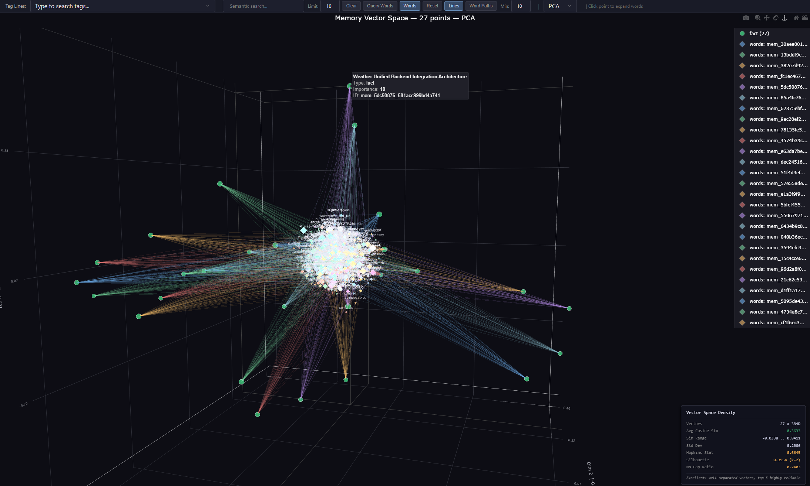

# Robust Long-Term Memory MCP

A persistent memory system for AI companions with pluggable storage backends, human-like decay/reinforcement dynamics, and seamless cross-session recall.

Detached fork of [Rotoslider/long-term-memory-mcp](https://github.com/Rotoslider/long-term-memory-mcp).

---

## Features

- **Pluggable backends**: SQLite + ChromaDB (default, zero infra) or PostgreSQL + pgvector (single DB for everything)
- **Cross-session continuity**: memories persist across chats, models, and machines
- **Automatic backups**: daily + every 100 memories, last 10 kept
- **Human-like dynamics**: lazy decay, reinforcement on recall, adaptive semantic threshold
- **Desktop GUI** (`memory_manager_gui.py`): browse, search, migrate, compare databases
- **3D Vector Visualizer** (`vector_visualizer.py`): interactive Plotly/Dash scatter of embeddings (PCA/t-SNE/UMAP)
- **System Tray App** (`tray_app.py`): dock/taskbar icon to manage the MCP server
- **OpenCode enforcement plugin**: gates all tools until recall and storage rules are met

---

## Installation

```bash
git clone https://github.com/Rotoslider/long-term-memory-mcp.git
cd long-term-memory-mcp
pip install -r requirements.txt
```

Core deps: `chromadb`, `sentence-transformers`, `fastmcp`, `tiktoken`, `numpy`, `torch`.

**Optional extras:**

```bash
pip install '.[pgvector]'       # PostgreSQL + pgvector
pip install '.[visualizer]'     # Plotly/Dash 3D visualizer
pip install '.[tray]'           # System tray app
pip install '.[tensorboard]'    # TensorBoard projector
pip install "huggingface_hub[hf_xet]"  # faster model downloads
```

---

## Project Structure

```
long-term-memory-mcp/
├── server.py                        # Main entry point
├── tray_app.py                      # System tray app
├── vector_visualizer.py             # 3D vector space visualizer
├── tensorboard_visualizer.py        # TensorBoard projector exporter
├── memory_manager_gui.py            # Desktop GUI
├── memory_mcp/                      # Core package
│   ├── memory_system.py             # RobustMemorySystem
│   ├── mcp_tools.py                 # MCP tool registration
│   ├── database_backends/           # SQLite / PostgreSQL
│   └── vector_backends/             # ChromaDB / pgvector
├── opencode/
│   ├── plugin/long-term-memory.ts   # OpenCode enforcement plugin
│   └── AGENTS.md                    # OpenCode global system prompt
├── install_opencode.sh              # Installs plugin + AGENTS.md (macOS/Linux)
├── install_opencode.ps1             # Installs plugin + AGENTS.md (Windows)
├── mcp-config-examples.json         # 15+ client config examples
├── docker-compose.yml               # pgvector Docker service
└── pyproject.toml                   # Package config + optional extras
```

---

## Architecture

### Default: SQLite + ChromaDB

Two local files, zero infrastructure. No extra setup needed.

```
SQLite (memories.db)  +  ChromaDB (chroma_db/)
```

### Optional: PostgreSQL + pgvector

Both structured data and vectors in one Postgres database.

```
PostgreSQL: memories table + memory_vectors table
```

Start with: `docker compose up -d` (uses `docker-compose.yml` defaults).

### Embedding model

| Model | Dims | Max tokens | Params |
|---|---|---|---|
| `BAAI/bge-small-en-v1.5` (default) | 384 | 512 | 33M |

Override with `MEMORY_EMBEDDING_MODEL` env var. See `memory_mcp/config.py` for presets.

---

## Running the Server

### Stdio transport (default)

```bash
python server.py                              # SQLite + ChromaDB
python server.py --vector-backend pgvector    # PostgreSQL + pgvector
```

MCP client config:

```json
{
  "mcpServers": {
    "long_term_memory": {
      "command": "python",
      "args": ["/path/to/server.py"]
    }
  }
}
```

### HTTP transport

```bash
python server.py --transport http
python server.py --transport http --host 0.0.0.0 --port 3000
```

```json
{ "mcpServers": { "long_term_memory": { "url": "http://localhost:8000/mcp/" } } }
```

See `mcp-config-examples.json` for 15+ client config examples.

### CLI arguments

| Argument | Default | Description |
|---|---|---|
| `--transport` | `stdio` | `stdio` or `http` |
| `--host` | `0.0.0.0` | HTTP bind address |
| `--port` | `8000` | HTTP port |
| `--path` | `/mcp/` | HTTP URL path |
| `--vector-backend` | `chromadb` | `chromadb` or `pgvector` |
| `--pg-host` | `PGHOST` / `localhost` | PostgreSQL host |
| `--pg-port` | `PGPORT` / `5433` | PostgreSQL port |
| `--pg-database` | `PGDATABASE` / `memories` | Database name |
| `--pg-user` | `PGUSER` / `memory_user` | User |
| `--pg-password` | `PGPASSWORD` / `memory_pass` | Password |

All `--pg-*` args fall back to the corresponding `PG*` env vars.

---

## pgvector Setup

```bash
docker compose up -d                          # starts pgvector on port 5433
python server.py --vector-backend pgvector    # uses docker-compose.yml defaults
```

On first run with an empty pgvector table, vectors are automatically re-embedded from the existing SQLite database (one-time migration).

Custom connection:

```bash
python server.py --vector-backend pgvector \
  --pg-host myserver.example.com --pg-port 5433 \
  --pg-database memories --pg-user memory_user --pg-password secret
```

Or set `PGHOST`, `PGPORT`, `PGDATABASE`, `PGUSER`, `PGPASSWORD` env vars.

---

## OpenCode Integration

### Sub-agent access

Sub-agents launched via the Task tool cannot call MCP tools by default. Grant them access in `opencode.json`:

```json
{
  "mcp": {
    "long-term-memory": { "url": "http://localhost:8000/mcp/", "type": "remote", "enabled": true }
  },
  "agent": {
    "general":  { "tools": { "long-term-memory_*": true } },
    "explore":  { "tools": { "long-term-memory_*": true } },
    "build":    { "tools": { "long-term-memory_*": true } },
    "plan":     { "tools": { "long-term-memory_*": true } }
  }
}
```

### Enforcement plugin

`opencode/plugin/long-term-memory.ts` hooks into OpenCode's lifecycle to enforce memory discipline:

| Hook | Behaviour |
|---|---|
| System prompt injection | Injects mandatory memory rules into every LLM call |
| Universal tool gate | Blocks all tools until `get_recent_memories` is called first |
| End-of-turn store gate | Blocks next turn's tools if files were edited but `remember` wasn't called |
| Idle warning | Logs a warning when a turn ends with edits but no store |
| Compaction hook | Preserves enforcement state across context compaction |

**Install (macOS/Linux):**

```bash
bash install_opencode.sh
```

This copies the plugin and `AGENTS.md` to `~/.config/opencode/`. Re-run anytime to update.

**Install (Windows):**

```powershell
.\install_opencode.ps1
```

### AGENTS.md

`opencode/AGENTS.md` is a condensed system prompt (what to store, tagging conventions, sub-agent templates). `install_opencode.sh` copies it automatically; or copy manually to `~/.config/opencode/AGENTS.md`.

---

## Desktop GUI

```bash
python memory_manager_gui.py
```

- **Memory Browser**: browse, search, edit, delete
- **Dashboard**: stats and type breakdown
- **Data source selector**: switch between SQLite/ChromaDB and pgvector at runtime
- **Migration tool**: bidirectional SQLite ↔ Postgres with progress bars, preview, skip-duplicates
- **Compare/Diff window**: side-by-side comparison (green=SQLite-only, blue=Postgres-only, yellow=modified, grey=identical)
- **ChromaDB Viewer**: inspect raw embeddings
- **Backup/export** to JSON

---

## 3D Vector Visualizer



```bash
pip install '.[visualizer]'
python vector_visualizer.py                          # PCA, colour by type
python vector_visualizer.py --method tsne            # t-SNE
python vector_visualizer.py --method umap            # UMAP
python vector_visualizer.py --colour-by importance   # red→green gradient
python vector_visualizer.py --vector-backend pgvector
```

**Features:** semantic search with similarity highlighting, click-to-expand word vectors, Word Paths (shared vocabulary lines), searchable tag dropdown, hover labels, dark theme, camera preservation across updates.

**Colour legend (by type):** blue=conversation, green=fact, amber=preference, red=event, purple=task, grey=ephemeral.

---

## System Tray App

```bash
pip install '.[tray]'
python tray_app.py             # macOS / Windows / Linux
python tray_app.py --auto-start
```

Start/stop/restart the server, launch GUI/visualizer/TensorBoard, view logs — all from the menu bar or taskbar. `--vector-backend` and `--pg-*` args are forwarded to all subprocesses.

---

## TensorBoard Embedding Projector

```bash
pip install '.[tensorboard]'
python tensorboard_visualizer.py                  # export + launch browser
python tensorboard_visualizer.py --export-only    # export only
python tensorboard_visualizer.py --vector-backend pgvector
```

Exports `tensors.tsv`, `metadata.tsv`, `projector_config.pbtxt`. Metadata: title, type, importance, tags, timestamp, ID. Supports both backends.

---

## How Memory Works

- **Cross-chats**: new chat, same memories
- **Cross-models**: swap models freely
- **Cross-machines**: copy `memory_db/` + `memory_backups/` to another machine

> Think of it as your AI's diary: chats are conversations, the database is the journal.

### Custom data directory

```bash
export AI_COMPANION_DATA_DIR="/home/username/ai_companion_data"   # Linux/macOS
$env:AI_COMPANION_DATA_DIR="D:\ai\data"                           # Windows PowerShell
```

---

## Backups

Auto-created every 24h or after 100 new memories; last 10 kept. Each backup includes:
- SQLite DB (SQLite mode) or JSON export (pgvector mode)
- ChromaDB copy (ChromaDB mode)
- JSON export (always)

---

## Recommended System Prompt

> You are an AI companion with long-term memory. Store facts naturally. Recall them when asked. Never expose internal tool usage to the user.

---

## MCP Tools

| Tool | Key params |
|---|---|
| `remember` | `title`, `content`, `tags`, `importance` (1-10), `memory_type` |
| `search_memories` | `query`, `limit` |
| `search_by_type` | `memory_type`, `limit` |
| `search_by_tags` | `tags`, `limit` |
| `get_recent_memories` | `limit`, `current_project` |
| `update_memory` | `memory_id`, then any field to change |
| `delete_memory` | `memory_id` |
| `get_memory_stats` | — |
| `create_backup` | — |
| `search_by_date_range` | `date_from`, `date_to`, `limit` |
| `rebuild_vectors` | — (repair: rebuild vector index from SQLite) |
| `list_source_memories` | `source_db_path`, `limit` |
| `migrate_memories` | `source_db_path`, `source_chroma_path`, `memory_ids`, `skip_duplicates` |

### Tool selection

| Trigger | Tool |
|---|---|
| User shares a fact | `remember` |
| Free-form recall | `search_memories` |
| "All preferences" | `search_by_type` |
| Tag-based request | `search_by_tags` |
| "What did we discuss recently?" | `get_recent_memories` |
| Update existing memory | `update_memory` |
| Forget something | `delete_memory` |
| Date range query | `search_by_date_range` |
| Stats / counts | `get_memory_stats` |
| Manual backup | `create_backup` |
| Semantic search broken | `rebuild_vectors` |
| Preview another DB | `list_source_memories` |
| Import from another DB | `migrate_memories` |

---

## What's New

**OpenCode Enforcement Plugin**
- `opencode/plugin/long-term-memory.ts`: universal tool gate, store gate, system prompt injection, compaction hook, idle warning
- `opencode/AGENTS.md`: condensed system prompt for what to store, tagging, sub-agent templates
- `install_opencode.sh`: one-command install/update script (macOS/Linux)
- `install_opencode.ps1`: one-command install/update script (Windows)

**Visualizers & Tray**
- `vector_visualizer.py`: Plotly/Dash 3D scatter — semantic search, word vectors, Word Paths, tag dropdown, dark theme
- `tensorboard_visualizer.py`: TensorBoard Embedding Projector export
- `tray_app.py`: cross-platform dock/taskbar icon

**Pluggable Backend Architecture**
- `DatabaseBackend` ABC: SQLite + PostgreSQL implementations
- `VectorBackend` ABC: ChromaDB + pgvector implementations
- Single-DB mode: pgvector consolidates structured + vector data in one Postgres database
- Auto-migration from ChromaDB on first pgvector run

**Desktop GUI Enhancements**
- Data source selector, bidirectional migration, database diff window

**Core Improvements**
- Modular `memory_mcp/` package (config, models, memory_system, mcp_tools)
- Semantic search: distance-to-similarity fix, adaptive threshold, top-1 fallback
- Human-like dynamics: lazy decay, reinforcement, adaptive threshold
- New tools: `rebuild_vectors`, `list_source_memories`, `migrate_memories`

---

## Contributing

PRs welcome. Found a bug? Open an issue.

## License

MIT
